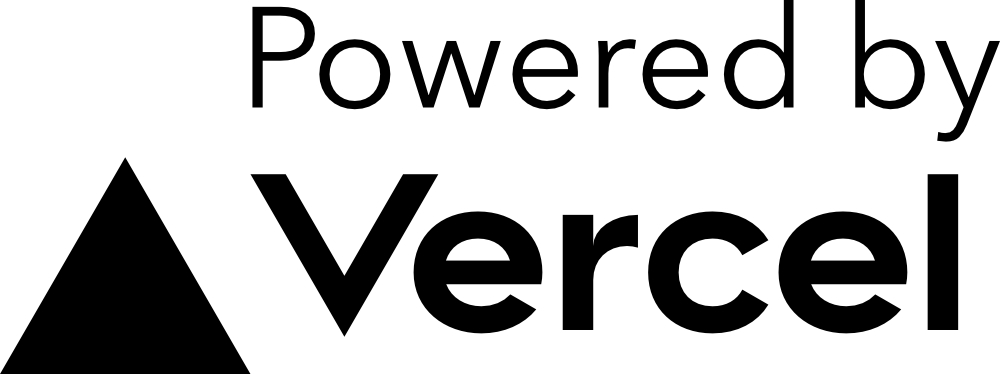

 

  

  <h3 align="center">nest.land</h3>

  

    An immutable module registry for Deno, on the blockchain
 

 

  
 

<!-- markdownlint-disable first-line-heading -->
## What is nest.land?
<!-- markdownlint-enable first-line-heading -->

Nest.land combines Deno with the [Arweave Blockchain](https://www.arweave.org/). With us, you can publish your Deno modules to the permaweb, where they can never be deleted. This avoids a major pitfall for web-based module imports while allowing the developer to maximize on the potential of Deno's import design!

## Repositories/Services

nest.land is split into many services, each in their own respective repositories, they are as follows:

- [nest.land](https://github.com/nestdotland/nest.land) - The landing repository for nest.land.
  It houses the website source code.
- [eggs](https://github.com/nestdotland/eggs) - nest.land's CLI
- [yolk](https://github.com/nestdotland/yolk) - nest.land's API library
- [website](https://github.com/nestdotland/website) - nest.land's website
- [API](https://github.com/nestdotland/api) - nest.land's API
- [twig](https://github.com/nestdotland/twig) - A mediator for nest.land's interactions with Arweave
- [x](https://github.com/nestdotland/x) - The module gateway for files to be accessed.

### Infrastructure Diagram

The mentioned services are keystone to making nest.land a better service.
This diagram is a visualisation of how these parts work together:

## Credits

### Authors

- [t8](https://github.com/t8) - Co-Founder, Frontend, & Project Management
- [zorbyte](https://github.com/zorbyte) - Co-Founder, Advisor, Triager & Code Quality Control
- [justablob](https://github.com/justablob) - Backend & CLI

### Core Team

- [divy-work](https://github.com/divy-work) - Backend Manager
- [maximousblk](https://github.com/maximousblk) - UX Manager
- [martondev](https://github.com/MartonDev) - Frontend Manager
- [oganexon](https://github.com/oganexon) - CLI Manager

### Contributors

- [ebebbington](https://github.com/ebebbington)
- [yg](https://github.com/yg)
- [jletey](https://github.com/jletey)
- [qu4k](https://github.com/Qu4k)

### Special Thanks

- [Cedrik Boudreau](https://github.com/cedriking)

### Inspirations

- [Deno Third-Party Modules](https://deno.land/x)

## Copyright

nest.land is licensed under the MIT license. Please see the [LICENSE](../LICENSE) file.

 

  

