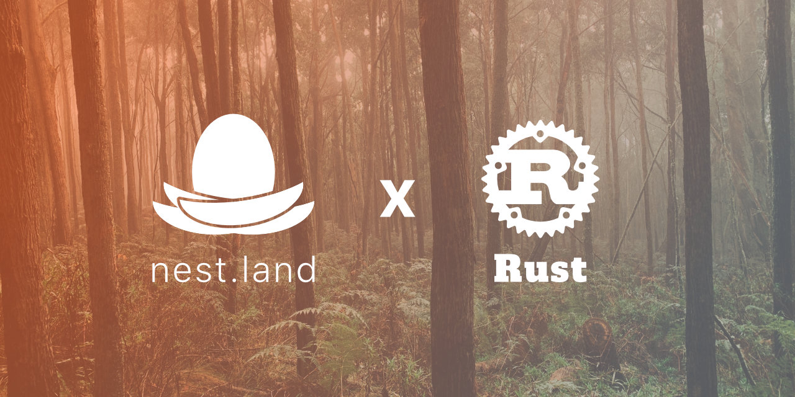

# Nest API - Rust

A graphql API for the nest.land registry.

> Note: Currently only read-only

## Usage

### Running server

```bash
cargo run (or ``cargo watch -x run``)
# Started http server: 127.0.0.1:8080
```

### Web client
[http://127.0.0.1:8080/graphiql](http://127.0.0.1:8080/graphiql)

### _Queries_

#### `package`

```graphql
{
  package(name: "eggs") {
    name,
    owner,
    normalizedName,
    latestVersion,
    latestStableVersion,
    packageUploadNames
  }
}
```
_Result:_
```json
{
  "data": {
    "package": {
      "name": "eggs",
      "owner": "nest.land",
      "normalizedName": "eggs",
      "latestVersion": "v0.1.0",
      "latestStableVersion": "v0.1.0",
      "packageUploadNames": [
        "eggs"
      ]
    }
  }
}
```

#### `user`

```graphql
{
  user(apiKey: "efc56537a8214c5b9d4320c551790cf3") {
    name,
    normalizedName,
  	createdAt
  }
}
```

```json
{
  "data": {
    "user": {
      "name": "divy[Divy]",
      "normalizedName": "divy_divy_",
      "createdAt": "2020-06-27T10:15:55.670232Z"
    }
  }
}
```

### _Mutations_

#### `createUser`

```graphql
mutation {
  createUser(newUser: { name: "divy [Divy]", password: "hehe"}) {
    name
    normalizedName
    apiKey
    packageNames
    createdAt
  }
}
```

_Result:_

```json
{
  "data": {
    "createUser": {
      "name": "divy [Divy]",
      "normalizedName": "divy _divy_",
      "apiKey": "efc56537a8214c5b9d4320c551790cf3",
      "createdAt": "2020-06-27T10:15:55.670232Z",
      "packageNames": [
        "autopilot"
      ]
    }
  }
}
```

#### `createPackage`

```graphql
mutation {
  createPackage(newPackage: {name: "autopilot", normalizedName: "autopilot", owner: "divy", description: "Cross-platform desktop automation", repository: "https://github.com/divy-work/nest-api-rust", latestVersion: "v0.1.0", latestStableVersion: "v0.1.0", packageUploadNames: ["autopilot"], locked: false, malicious: false, unlisted: false, updatedAt: "sometime", createdAt: "sometime"}) {
    name
    owner
    normalizedName
    latestVersion
    latestStableVersion
    packageUploadNames
  }
}
```

_Result:_
```json
{
  "data": {
    "createPackage": {
      "name": "autopilot",
      "owner": "autopilot",
      "normalizedName": "autopilot",
      "latestVersion": "v0.1.0",
      "latestStableVersion": "v0.1.0",
      "packageUploadNames": [
        "autopilot"
      ]
    }
  }
}
```
